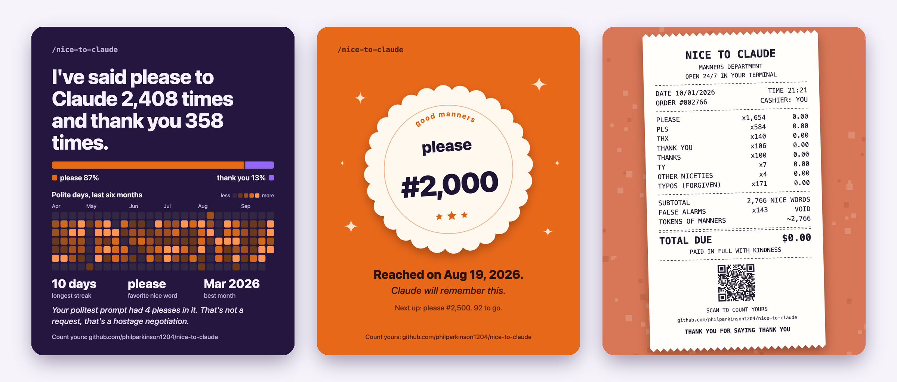

# nice-to-claude 🙏

How polite are you to Claude? A tiny Claude Code plugin that counts every **please** and **thank you** you type, with a `/stats`-style dashboard and a statusline counter.



```
🫶 2,362 (▲ +4 please) · 🙏 340 (▲ +4 thanks) · ▃▃▅▄··█ · 🔥 3d
```

## What you get

- **`/nice-to-claude`**: a dashboard with your please/thanks split, a bar for each month, all-time / 30-day / 7-day stats, charts of how and when you're polite, and a random fun fact.
- **Optional statusline**: live all-time totals, this chat's count in parentheses, and a 7-day sparkline — one-time setup required.
- **Milestones**: a one-line message when you hit please #100, #500, #1,000 and so on.
- **`/nice-to-claude share`**: share cards for your stats, opened in your browser (see below).
- **`/nice-to-claude audit`**: every recent match, and why it did or didn't count.

## Install

For Claude Code (it reads Claude Code's own prompt history, so it doesn't apply to claude.ai or Cowork). Needs Python 3.8+ as `python3` and nothing else: it's built for macOS, Linux and WSL. On a Mac, if `python3 --version` offers to install the developer tools, say yes.

From GitHub:

```sh
claude plugin marketplace add philparkinson1204/nice-to-claude
claude plugin install nice-to-claude@nice-to-claude
```

Restart Claude Code and run `/nice-to-claude`. If another plugin or skill already uses that name, the full name `/nice-to-claude:nice-to-claude` always works.

Once it's listed in the Claude plugin directory, you can also run `/plugin` in Claude Code, search for **nice-to-claude**, and install it from there.

### Statusline (optional — one-time setup)

Claude Code doesn't let plugins enable a status line automatically. After installing, send one message, then run `/statusline` and ask Claude:

> Use Nice to Claude's status line with `sh ~/.cache/nice-to-claude/statusline.sh`.

If you already use a custom status line, ask Claude to merge Nice to Claude into it instead of replacing it.

Prefer to configure it manually? Add this to `~/.claude/settings.json`:

```json
"statusLine": { "type": "command", "command": "sh ~/.cache/nice-to-claude/statusline.sh", "padding": 0, "refreshInterval": 10 }
```

The plugin's install folder changes with every update, so it keeps that small launcher pointed at the current version. The launcher is created when you send a message or open `/nice-to-claude` after installing.

`refreshInterval` keeps the totals in sync when you have several Claude Code windows open. Without it, a window only updates when something happens in it. Each refresh takes about 30 ms.

| Part | Meaning |
|---|---|
| `🫶 2,362 (▲ +4 please)` | pleases: all time, then this chat |
| `🙏 340 (▲ +4 thanks)` | thank-yous: all time, then this chat |
| `▃▃▅▄··█` | the last 7 days, today on the right (`·` means none) |
| `🔥 3d` | polite days in a row (shows from 2) |
| `» 3 in a row` | polite messages in a row in this chat (shows from 2) |

## Share your stats

`/nice-to-claude share` opens a page in your browser with three cards, each 1080 × 1350 (the 4:5 size that shows uncropped on Instagram, X, LinkedIn, Threads and Bluesky):

| Card | What's on it |
|---|---|
| Summary | your totals, every polite day for six months, your longest streak, favorite nice word, best month and a fun fact |
| Milestone | your latest please or thank-you milestone as a good-manners sticker |
| Receipt | an itemized receipt for your manners, total due $0.00, with a QR code to this plugin |

Each card has **Download PNG**, **Copy image** and **Copy caption** buttons, plus links that open a post draft with the caption on X, Bluesky or Threads (you attach the card). LinkedIn only takes a link, so its button copies the caption for you to paste. There's also a one-page summary to print or save as a PDF from the print window. It lays itself out for Letter or A4 with its own margins, so the print window's margin setting doesn't matter: pick the size next to the print button (it starts on Letter in the US and Canada, A4 elsewhere).

The cards show counts and dates only: never your prompts, and never your project names.

## What counts

It reads `~/.claude/history.jsonl`, the prompts you've typed into Claude Code. It counts please, pls, pretty please, thank you, thanks, thx, ty and appreciate it, plus typos like `pelase` and `thansk`.

Pleases and thanks that aren't aimed at Claude are skipped:

| Skipped | Example |
|---|---|
| quotes, code and paths | `make the button say "Please sign in"` |
| UI or customer copy | `add a thank you page`, `thanks for your order` |
| talking about the word | `how many times have I said please?` |
| drafted or pasted messages | `reply to Alex saying thanks`, pasted emails and chats |
| not meant for Claude | `thank god`, `thanks to the cache`, `hard to please` |
| resends | a message you stop and send again counts once |

## Privacy and data

Everything runs on your machine, and the plugin makes no network requests of its own.

- **Reads:** `~/.claude/history.jsonl` (the prompts you've typed into Claude Code), or `$CLAUDE_CONFIG_DIR/history.jsonl` if you've set that.
- **Hook:** one `UserPromptSubmit` hook. Each time you send a prompt, it runs this plugin's own script with `python3` to check whether that prompt hit a milestone. If it did, you see the one-line message; otherwise it does nothing. It never blocks or changes your prompt, and it keeps the statusline launcher (below) pointed at the current install.
- **Writes:** a small cache in `~/.cache/nice-to-claude/`. It holds counts only: your totals, a count per day, and a count per recent chat. To recognize a message you stopped and sent again, it also keeps a one-way fingerprint (a SHA-256 hash) and the length of each chat's latest message, never the text itself. It also writes `statusline.sh` there, a two-line launcher for the statusline that runs this plugin's own script.
- **Share page:** `/nice-to-claude share` writes `share.html` to the same folder, with your numbers in it (no prompt text, no project names), and opens it in your default browser. The page loads nothing from the internet. Its post links open X, Bluesky, Threads or LinkedIn only when you click one, and send that site the caption you see (your totals and a link to this plugin) as the draft. The copy buttons put the card or caption on your clipboard.
- **Shared with Claude:** only what `/nice-to-claude` shows you, because slash commands display their output through a quick Haiku reply. That's the dashboard's numbers and your politest project's folder name, or for `/nice-to-claude audit`, short snippets of your past prompts. For `/nice-to-claude share`, it's a one-line confirmation and the page's file path.

Uninstalling doesn't touch your history file. Delete `~/.cache/nice-to-claude/` to remove the cache.

Full details: [Privacy policy](PRIVACY.md).

## Other ways to run it

`nice-to-claude` is on your PATH while the plugin is enabled:

```sh
! nice-to-claude            # the dashboard, from Claude Code's bash mode
! nice-to-claude audit skipped  # what was thrown out, and why
! nice-to-claude share --no-open  # make the share page without opening a browser
```

To uninstall, run `claude plugin uninstall nice-to-claude@nice-to-claude`, remove the `statusLine` entry and delete `~/.cache/nice-to-claude/`.

## License

MIT
